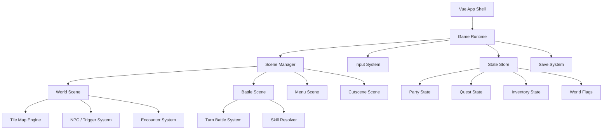
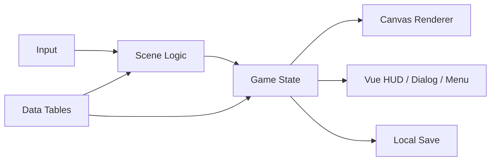
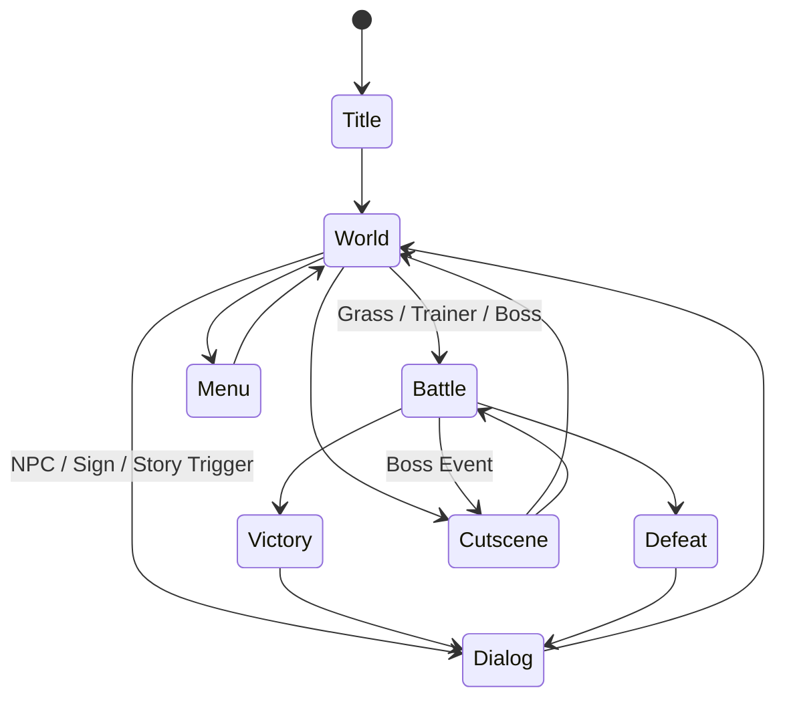

# Pocket Grove 遊戲藍圖

## 定位

這是一款原創的 GB 風怪獸收集 RPG。
核心目標不是重製既有 IP，而是保留經典掌機世代的探索、收集、培育與道館挑戰節奏，做出一套可長期擴充的原創世界。

專案暫定名稱：
`Pocket Grove`

世界基調：
1. 懷舊掌機感
2. 小鎮與荒野並存的探險感
3. 輕度神秘、溫暖成長型主線

---

## 核心體驗

玩家在晨芽地區展開第一次正式巡遊，與夥伴怪獸一起：
1. 探索城鎮、道路、洞穴、森林、研究設施
2. 收服原創怪獸並組成隊伍
3. 挑戰 8 位巡守館主
4. 阻止企業組織「棱鏡會」回收古代能源核心
5. 前往天空遺跡，決定古代守護獸的命運

---

## 主線總覽

### 序章：晨芽鎮

玩家住在晨芽鎮，受到研究員摩菈邀請，前往野外測試新型怪獸圖鑑。
摩菈發現晨芽地區各處的怪獸開始出現異常活性，似乎與古代遺跡能量重新啟動有關。

劇情目標：
1. 選擇初始夥伴
2. 學會移動、對話、捕捉、戰鬥
3. 打敗第一位新手勁敵
4. 拿到圖鑑與巡遊許可

---

### 第一章：綠徑試煉

玩家離開晨芽鎮，穿過綠徑原野與微光森林，抵達第一座巡守館所在地「苔橋市」。
途中會第一次遇到棱鏡會的基層成員，他們正在收集特定屬性的怪獸與古代碎片。

劇情目標：
1. 取得捕捉器
2. 完成第一批圖鑑紀錄
3. 挑戰第一巡守館
4. 發現棱鏡會正在追查「星核」

---

### 第二章：機巧與水脈

玩家前往工業城市與水庫地帶，認識晨芽地區的能源系統。
棱鏡會滲透到發電設施，企圖利用古代技術控制怪獸遷移路線。

劇情目標：
1. 解決停電與水門異常
2. 取得第 2、3 枚徽章
3. 發現棱鏡會不只是反派組織，也和官方財團有合作關係

---

### 第三章：山嶺與回音洞

玩家翻越高地與洞窟，接觸更古老的文明痕跡。
摩菈逐步拼出真相：晨芽地區的怪獸棲地其實建立在一個巨大古代環狀裝置之上。

劇情目標：
1. 取得攀爬、推石、簡易照明等探索能力
2. 進入回音洞深處
3. 取得第一枚星核碎片
4. 與勁敵正式分歧

---

### 第四章：海港與鏡灣

玩家抵達沿海城市與群島地區。
棱鏡會開始公開行動，試圖回收埋藏在海底神殿的第二枚星核碎片。

劇情目標：
1. 取得第 4、5 枚徽章
2. 解鎖乘浪移動
3. 潛入海底神殿
4. 阻止棱鏡會幹部奪走完整星核

---

### 第五章：霜原研究區

北方凍原與舊研究設施揭露了地區歷史。
古代文明曾利用守護獸穩定氣候，但後來因能源失控而毀滅。
棱鏡會認為只要重新控制守護獸，就能建立完美秩序。

劇情目標：
1. 取得第 6、7 枚徽章
2. 進入封存研究站
3. 找到摩菈導師留下的紀錄
4. 確認最終遺跡位置

---

### 第六章：棱鏡塔事件

棱鏡會在首都「璃冠市」啟動棱鏡塔，試圖將星核能量強制同步到整個地區。
大量怪獸失控，城市封鎖。

劇情目標：
1. 取得第 8 枚徽章
2. 潛入棱鏡塔
3. 擊敗棱鏡會首席執行官與四名幹部
4. 奪回完整星核

---

### 終章：天空遺跡

玩家與摩菈前往天空遺跡，面對甦醒的守護獸。
最後選擇不是單純擊倒守護獸，而是決定要：
1. 安撫並釋放它
2. 暫時封印它
3. 與其締結契約

這個選擇會影響結局與 postgame 區域。

---

## 主要角色

### 玩家

晨芽鎮的新手巡遊者。
角色主題是成長與選擇。

### 研究員 摩菈

年輕研究員，主線引導者。
一開始專注研究，後期面對自己老師留下的真相與責任。

### 勁敵：祈澤

和玩家同時出發的競爭者。
前期追求效率與力量，後期一度認同棱鏡會的理念，最後再重新思考什麼叫保護怪獸。

### 棱鏡會首席：維洛

相信混亂的人與怪獸世界必須由絕對秩序統一管理。
不是為惡而惡，而是極端功利主義者。

### 守護獸：曙脈龍

古代能源中樞的活體化身。
象徵地區的生命循環與失衡風險。

---

## 地區與主線順序

1. 晨芽鎮
2. 綠徑原野
3. 微光森林
4. 苔橋市
5. 鐵渠市
6. 鏡灣水庫
7. 回音洞
8. 雲脊高地
9. 鏡灣港
10. 群島神殿
11. 霜原研究區
12. 璃冠市
13. 棱鏡塔
14. 天空遺跡

---

## 系統架構

### 遊戲層級



### 資料流



---

## 建議目錄架構

```text
src/
  App.vue
  main.ts
  style.css
  game/
    engine/
      gameLoop.ts
      sceneManager.ts
      renderer.ts
      input.ts
      camera.ts
    scenes/
      worldScene.ts
      battleScene.ts
      menuScene.ts
      cutsceneScene.ts
    systems/
      movementSystem.ts
      collisionSystem.ts
      interactionSystem.ts
      encounterSystem.ts
      battleSystem.ts
      questSystem.ts
      saveSystem.ts
    data/
      creatures.ts
      skills.ts
      items.ts
      trainers.ts
      maps/
        dawnbudTown.ts
        mossbridgeCity.ts
        echoCave.ts
    types/
      game.ts
      map.ts
      battle.ts
      quest.ts
  components/
    DialogBox.vue
    BattleMenu.vue
    PartyPanel.vue
    QuestPanel.vue
    TitleScreen.vue
```

---

## 場景狀態機



---

## 主線 Quest 結構

每個主線任務建議使用相同結構：

1. `id`
2. `title`
3. `description`
4. `stage`
5. `requirements`
6. `completionFlags`
7. `rewards`
8. `nextQuestId`

範例：

```ts
type MainQuest = {
  id: string;
  title: string;
  description: string;
  stage: number;
  requirements: string[];
  completionFlags: string[];
  rewards: string[];
  nextQuestId: string | null;
};
```

---

## 戰鬥系統第一版到完整版演進

### 第一版

1. 單隻對單隻
2. 攻擊 / 防禦 / 簡單技能
3. 血量、傷害、勝敗

### 第二版

1. 屬性相剋
2. 4 招技能欄
3. 狀態異常
4. 捕捉機制
5. 經驗值與升級

### 第三版

1. 隊伍切換
2. 道具使用
3. 訓練家戰鬥
4. Boss 特殊機制

---

## 世界探索系統

### 必做能力

1. Tile map 載入
2. 障礙碰撞
3. NPC 對話
4. 場景切換
5. 草叢遭遇
6. 寶箱 / 地上物互動

### 中期擴充

1. 推石
2. 砍樹
3. 衝浪
4. 攀爬
5. 照明洞穴

---

## 存檔結構

```ts
type SaveData = {
  playerName: string;
  playTime: number;
  currentMapId: string;
  playerPosition: { x: number; y: number };
  party: string[];
  boxedCreatures: string[];
  inventory: Record<string, number>;
  badges: string[];
  questId: string;
  questStage: number;
  flags: Record<string, boolean>;
};
```

---

## 製作順序

### Phase 1：可玩的垂直切片

1. 世界移動
2. 碰撞
3. 對話
4. 草叢遇敵
5. 簡化戰鬥

### Phase 2：主線骨架

1. 多地圖切換
2. 主線任務系統
3. 勁敵戰
4. 第一巡守館

### Phase 3：正式 RPG 化

1. 捕捉
2. 隊伍
3. 升級
4. 技能系統
5. 存檔

### Phase 4：完整內容

1. 8 館主線
2. 棱鏡會幹部戰
3. 終章遺跡
4. 結局分支

---

## 下一步建議

下一個實作階段建議直接做下面四件事：

1. 把目前原型拆成 `worldScene` 和 `battleScene`
2. 建立 `questSystem` 與主線旗標
3. 建立第一張正式地圖與出入口
4. 加入第一批原創怪獸、技能、捕捉資料表

這樣之後每加一個城市或章節，都只是往這套骨架上掛資料與事件，不用每次重寫核心。
